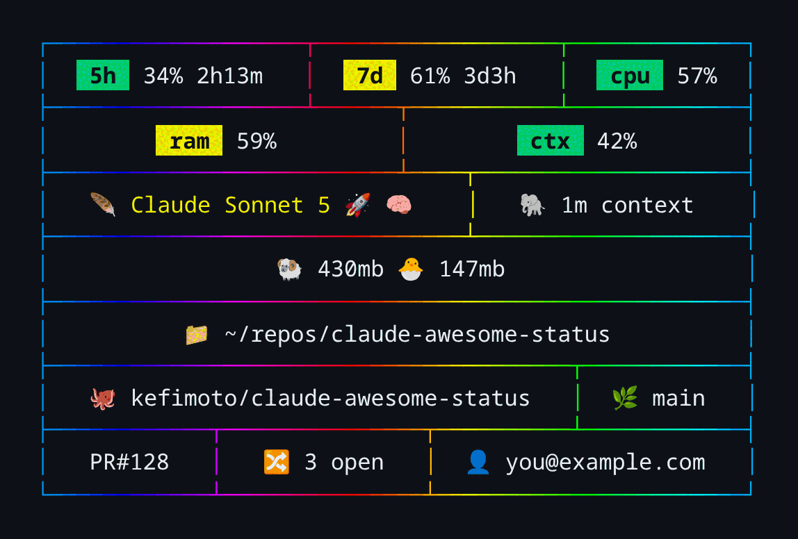

# claude-awesome-status

A statusline for [Claude Code](https://claude.com/claude-code) that packs 5-hour/7-day usage, model, context, system load, git, and PR info into a boxed panel — with a border that visibly cycles color on every render, and every part of it configurable from a JSON or YAML file.



*(All values above are illustrative — usage percentages, PR counts, and the account email are demo placeholders, not real data.)*

## What it shows

- **Usage badges** — 5-hour and 7-day rate-limit usage, each turning yellow then red as you approach the cap, with time-until-reset alongside.
- **System load** — CPU load average and RAM usage as the same green/yellow/red badges.
- **Context window** — used-percentage badge, plus the raw context size (`🐘 1m context`, `🐁 200k context`).
- **Model** — display name, tinted and tagged with an emoji per model family (🍃 Haiku, 🪶 Sonnet, 🎼 Opus, 🦊 Fable), plus 🚀 for fast mode and 🧠 when extended thinking is on.
- **Claude process memory** — RSS of the running `claude` process and its child processes, walked up from this script's own process ancestry.
- **Directory & git** — current working directory (home collapsed to `~`), GitHub repo slug, and current branch.
- **PR status** — the active PR number (if Claude Code reports one) and the repo's total open PR count via `gh`.
- **Account** — the logged-in Claude account email.
- **A living border** — the default style is a hue gradient that advances one tick every redraw, so it visibly animates as you work. `solid` and `none` are built in too, and it's pluggable (see [Styles](#styles)).

Rows wrap automatically to fit your terminal width, and every segment is padding-centered so the box always looks intentional, not improvised. All of this — which segments appear, what order, badge thresholds, the border style, even segments backed by your own commands — is controlled by an optional config file. With no config file present, none of that changes: you get exactly the behavior above.

## Requirements

- **`bash` 4.3+.** macOS ships bash 3.2 by default (frozen there for licensing reasons, not updated since ~2007) — this script needs newer than that. `install.sh` detects this automatically and points Claude Code at a qualifying bash's absolute path (installing one is a one-time `brew install bash` if you don't already have one). See [Install](#install).
- `jq`, `bc`, `awk`, `ps` — all standard on Linux and macOS
- [`gh`](https://cli.github.com/) (optional) — for the open-PR-count segment; the segment is simply omitted if it's not installed
- For a **YAML** config specifically (JSON needs nothing extra): either [`yq`](https://github.com/mikefarah/yq) or `python3` with `PyYAML`. Neither installed and your config is YAML? It quietly falls back to built-in defaults instead of failing — see [Config file](#config-file).
- A terminal font with color emoji support (e.g. [Noto Color Emoji](https://fonts.google.com/noto/specimen/Noto+Color+Emoji)) for the emoji glyphs to render properly

## Install

```bash
git clone https://github.com/kefimoto/claude-awesome-status.git
./claude-awesome-status/install.sh
```

That's it — restart Claude Code (or start a new session) and the boxed statusline replaces the default one-liner. `install.sh` only touches the `statusLine` key in `~/.claude/settings.json`; everything else in that file (hooks, permissions, plugins, whatever else is in there) is left exactly as it was, and a timestamped backup is written before any change. Safe to re-run — it's a no-op if `statusLine` already points here.

Prefer not to run a script against your own settings file? The manual equivalent:

```bash
chmod +x claude-awesome-status/statusline.sh
```

```json
{
  "statusLine": {
    "type": "command",
    "command": "bash /path/to/claude-awesome-status/statusline.sh"
  }
}
```

## Config file

Everything below is optional. With no config file, you get the default panel shown above, byte-for-byte.

**Where it looks:** the first readable file among, in order:

1. `$CAS_CONFIG`, if set — used exactly as given, no fallback search. Handy for testing a config, or for pointing multiple machines at a shared dotfiles path.
2. `~/.config/claude-awesome-status/config.json` (or `.yaml` / `.yml`)
3. `~/.claude/claude-awesome-status.json` (or `.yaml` / `.yml`)
4. Nothing found → built-in defaults.

A malformed config (bad JSON/YAML, wrong types, unknown fields) never breaks the statusline — it silently falls back to defaults for whatever it couldn't parse. See `examples/` for a complete annotated JSON config and its YAML equivalent.

### Styles

```json
{ "style": "rainbow", "style_options": { "color": "#5f87af" } }
```

- `rainbow` (default) — the animated hue gradient.
- `solid` — a single static color; set it via `style_options.color` (hex, default `#00afff`).
- `none` — no border color at all, just plain box-drawing characters.

### Thresholds

Badge colors (green → yellow → red) are configurable per metric. Any threshold you omit keeps its built-in default:

```json
{
  "thresholds": {
    "five_hour": { "yellow": 50, "red": 80 },
    "seven_day": { "yellow": 50, "red": 80 },
    "cpu":       { "yellow": 70, "red": 100 },
    "ram":       { "yellow": 50, "red": 80 },
    "context":   { "yellow": 50, "red": 75 }
  }
}
```

### Order, grouping, and hiding

`groups` is a list of segment-name lists. Each inner list — a **group** — wraps into as many terminal rows as it needs on its own; that's what keeps the usage badges visually separate from the identity row even when either wraps. **A group is not the same thing as a rendered row** — the default config below is 2 groups but renders 5 rows, and `max_rows` (next section) counts rendered rows, not groups.

Built-in segment names: `five_hour seven_day cpu ram context model context_size claude_ram dir repo branch pr open_pr account`.

```json
{
  "groups": [
    ["five_hour", "seven_day", "cpu", "ram", "context"],
    ["model", "context_size", "claude_ram", "dir", "repo", "branch", "pr", "open_pr", "account"]
  ],
  "hide": ["account", "claude_ram"]
}
```

Setting `groups` replaces the default wholesale — if you add a [custom segment](#custom-segments), it only appears if you also list its name somewhere in `groups`. `hide` is for small subtractive edits without restating the whole order; it works on custom segments too.

### max_rows and priority

`max_rows` is a target row count the renderer tries to respect by dropping the lowest-priority segments first, then wrapping again. `priority` is 1–99 (higher survives longer) or `100`, which pins a segment so it's never dropped:

```json
{
  "max_rows": 4,
  "priority": {
    "account": 10,
    "open_pr": 20,
    "pr": 25
  }
}
```

Built-in defaults pin `five_hour`, `seven_day`, `model`, and `dir`; everything else has a sensible non-pinned default so `max_rows` alone does something reasonable without also having to configure every priority by hand. If the target is unreachable (e.g. `max_rows` set below what the pinned segments alone need), the statusline renders over budget rather than dropping a pinned segment or failing — it's a best-effort target, not a hard limit.

### Custom segments

A `segments` map defines segments backed by your own command:

```json
{
  "segments": {
    "k8s": { "command": ["kubectl", "config", "current-context"] },
    "worktree": { "command": "git worktree list | wc -l", "timeout": 2 },
    "gitstat": { "inline": "printf '\\033[33m%s dirty\\033[0m' \"$(git status --porcelain | wc -l)\"" }
  },
  "groups": [["k8s", "worktree", "gitstat"]]
}
```

- `command` as an array execs directly with no shell involved — the safest form.
- `command` as a string, or `inline`, runs through `bash -c`. There's no privilege difference between the two; `inline` just means the code lives in your config instead of an external script.
- `timeout` (seconds, default 1) bounds how long a segment can block a redraw.
- A name matching a built-in (e.g. `"dir"`) replaces it.
- Output is taken as a single line; anything after the first newline is dropped.

**Two things worth knowing:**

- **Your config file is executable code.** Claude Code already runs `statusline.sh` as an arbitrary shell command from `settings.json`, so a config's `inline` snippets grant no authority you don't already have — but treat a config file exactly like you'd treat a `.bashrc`: don't paste one you don't understand.
- **Only SGR color codes survive width calculations.** A custom segment's output is measured for box alignment assuming it contains plain text plus, at most, standard `\033[...m` color codes. Other escape sequences (cursor movement, hyperlinks, etc.) will make that segment's row misalign.

See `examples/config.json` and `examples/config.yaml` for a complete config exercising all of the above.

## Development

`test/run.sh` renders every fixture in `test/fixtures/` and config in `test/configs/` against a fully stubbed system (`ps`, `git`, `gh`, `claude`, the clock — see `test/stubbin/`) and diffs the result against byte-exact goldens in `test/golden/`. Run it after any change to `statusline.sh`; `test/run.sh --update` regenerates the goldens once you've confirmed a difference is intentional.

## Roadmap

- A Claude Code skill to configure the statusline interactively (pick a style, toggle segments, tune thresholds, preview the result) instead of hand-editing a config file.

Contributions and ideas welcome — open an issue or a PR.

## License

[MIT](LICENSE)
